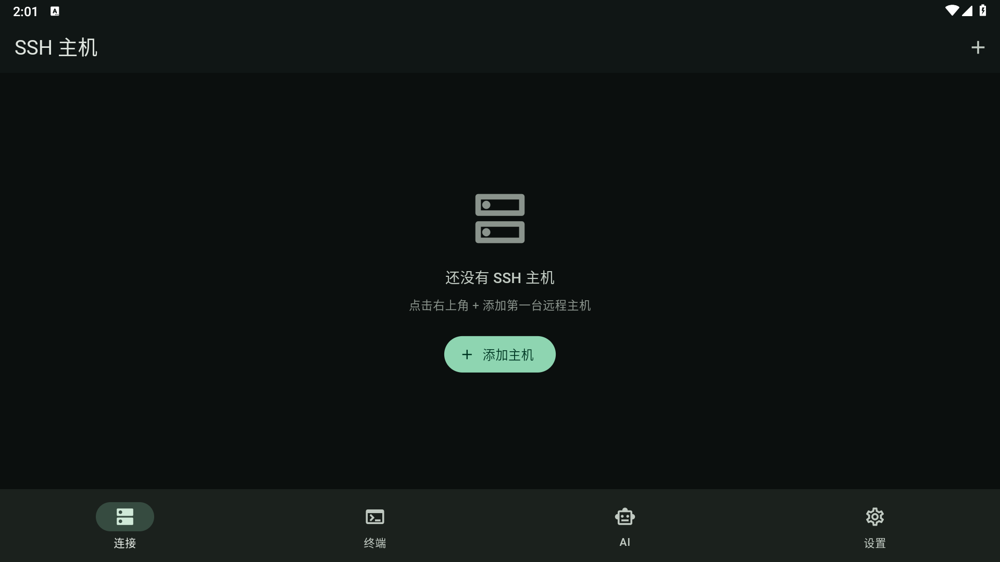

# TermuxCode

**TermuxCode** — 手机上的 AI 终端 / Coding Agent（Flutter）。

用自然语言驱动 **本机 Termux 风格工作流** 与 **远程 SSH**：内置 PTY 终端、BYOK 大模型、命令批准，并逐步融入 Claude Code / OpenCode 式 **Agent Harness**（工具池 · 权限门 · Plan/Build）。



仓库：https://github.com/Zst0NE/TermuxCode

## 定位

| 维度 | 说明 |
|------|------|
| 名字 | **TermuxCode**（AI 驱动的终端 + 编码代理） |
| 近景 | 远程 SSH + AI 批准执行（已可用） |
| 目标 | 本机 Termux 优先 + Agent Runtime（多工具 / 权限档位 / Plan·Build） |
| 差异化 | 移动端默认可控审批 · BYOK · 终端与 Agent 共用执行层 |

## 功能（当前）

- **SSH 主机管理**：密码 / 私钥，凭据进系统安全存储；host key 首次信任
- **交互式终端**：`dartssh2` + `xterm`，功能键栏、字体缩放、NL→命令魔法棒
- **AI 助手**：OpenAI 兼容 / Anthropic，`run_command` 批准闭环回灌 LLM
- **BYOK**：自定义 Base URL / 模型 / API Key
- **Markdown** 回复渲染

## Agent Harness（进行中）

参考 Claude Code / Codex / OpenCode 共性架构：

```text
UI (Chat / Terminal / Mode)
        │
  AgentRuntime (loop + max_steps + cancel)
        │
 ToolRegistry  ×  PermissionGate  ×  ContextBuilder
        │
 Executors: SSH shell · (planned) Local Termux · File · Search
```

- **Plan**：只读探索  
- **Build**：经权限的 shell / 写操作  
- **Permission**：allow / ask / deny（默认 ask）

## 技术栈

| 层 | 方案 |
|----|------|
| UI | Flutter · Material 3 · Provider |
| SSH | `dartssh2` |
| 终端 | `xterm` |
| 安全存储 | `flutter_secure_storage` |
| LLM | `http` 直连 OpenAI / Anthropic API |

## 快速开始

```bash
flutter pub get
flutter run
# 或
flutter build apk --debug
```

雷电示例：

```bash
adb connect 127.0.0.1:5555
adb install -r build/app/outputs/flutter-apk/app-debug.apk
adb shell monkey -p com.example.termux_ai -c android.intent.category.LAUNCHER 1
```

## 安全

- API Key / SSH 密钥仅 OS Keystore  
- 危险命令需用户批准（Agent 模式下仍保留危险命令拦截）  
- Host key 变更拦截  

## 许可证

个人 / 学习项目。
